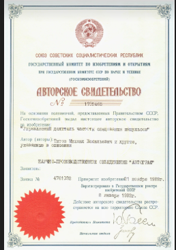
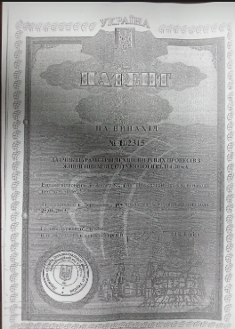

[Linkedin]:https://www.linkedin.com/in/michael-vt/

[MailTo]:mailto:m.v.titov@gmail.com

[ComDev]:http://comdev.com.ua/job_package/

[ECozy]:http://ecozy.de

[ManometrKharkiv]:http://manometr-kharkov.com/

[ManometrK]:http://manometr-kharkov.com/downloads/

[ManometrS]:https://manometr-harkov.uaprom.net/p255058-datchiki-davleniya-safir.html

[Patent1]:https://drive.google.com/open?id=1Q6v4YtH4M6LlIqgkGPzsptgKkvKv9Egz

[Patent1pic]:https://drive.google.com/open?id=1BxY3qMsuM42b5EiN9HSB4TFMnmDWju_a

[Patent2]:https://drive.google.com/open?id=1BB5SLDzZKVVzYbh48g40nXWePe4Vj17A

[Patent2pic]:https://drive.google.com/open?id=1CnXbUUqm64Ci6wVSxgZG8IDBo79XBw9b

***
[LinkEdin ][Linkedin]  -::-  [E-mail][MailTo]  -::-  [ComDev.com.ua/projects][ComDev]
***
> E-mail: [m.v.titov@gmail.com](mailto:m.v.titov@gmail.com) | [LinkEdin.][Linkedin]
[linkedin.com/in/michael-vt](https://www.linkedin.com/in/michael-vt/) | Location: Ukraine, Kharkiv
***

# Michael Titov &ndash; R&D Engineer, CTO
- 30+ years of experience in software/hardware solutions development, from idea to mass production. / Более 30 лет опыта в разработке программных и аппаратных решений, от идеи до массового производства.
- a great expertise in managing projects from scratch till production / большой опыт в управлении проектами с нуля до производства
- excellent practice due to participation in numerous start-up teams / отличная практика благодаря участию в многочисленных start-up командах
- registered copyright certificate, patent and model / зарегистрированное авторское свидетельство, патент и полезная модель:
  - Certificate of authorship / Авторское свидетельство [**`SU 1732465 A1 H03K23/40 23/66 - 1989-11-21`**][Patent1] 
  - Patent / Патент [**`UA 102315 G08C 19-02 (200.01) 2013-06-25 N102315 193403`**][Patent2] 

## Education
**Kharkiv National University of Radioelectronics, Kharkiv, Ukraine**
*August 1981 &ndash; August 1996*
- electronic devices, an engineer / электронные устройства, инженер
- microchip production technologist / технолог по производству микросхем
*Researcher in I/O Graphic Devices. / Исследователь графических устройств ввода / вывода.*
*Participation in the student research team. / Участие в студенческом научном отряде.*

## Skills
- Methodology &ndash; Cross-platform Development, Object-Oriented
- Software Architecture Style & Patterns &ndash; Monolithic Application, Layered, Plug-ins, Client-Server, Peer-to-Peer, Finite State Machine, Microkernel (resource limited)
- Programming Languages &ndash; C/C++, Pascal, Perl, Python, CUDA, Ruby, Go, JavaScript, Verilog, Verilog HDL
- Editors &ndash; Numbers, Pages, MS Office, Exel, Notepad ++, Sublime Text 3, Atom, Vim, Blender, Movie, Gimp
- UI libs &ndash; Delphi UI, Qt GUI, HTML/CSS
- OS &ndash; Windows, Linux, MacOS X
- Development Environments &ndash; GitHub, Doxygen, RedMine, Gitlab, Nextcloud, Delphi 6/7, Borland C++, Jupyter Notebook Python/Ruby/R (in progress)
- Version Management &ndash; git

## Design & Contruction
- 3D images and designs &ndash; Solid Works, SketchUp

## Circuits & PCB Development /  Разработка схемы и печатных плат
- Pcad2004
- AltiumDesigner
- FPGA Xilinx – Vivado
- FPGA Altera – Quartus II

## Worked with protocols / Работал с протоколами
- HP-GL
- G-Code
- ZigBee
- TCP/IP
- LoRa
- BlueTooth
- RS485
- CAN
- I2C
- SPI
- LPT
- UART
- ModBus/SMBus
- HART

## Embedded related skils / Навыки по встраиваемым системам
- Programming Languages: C, C++, PLM, CPM, Arduino, FreeRTOS, LwIP, Java (Android Studio)
- Toolchains & Environments: IAR (Microchip PIC18, MSP430, Friscale), CodeWarrior, System Workbench, Atollic TrueSTUDIO (Eclips, arm-none-eabi for STM32), CoCox, Beekit, Arduino, STM32Cube, MinGW
- Microcontrollers:
  - STMicroelectronics (STM32F1xx, STM32F4xx, STM32F437, STM32W108)
  - Microchip (PIC12Fxxx, PIC16Fxxx, PIC18Fxxx, PIC24Fxxx)
  - Freescale (MC13224V, TPMS_MPXY8300, MC9S12XEP100RMV1)
  - TexasInstrument(MSP430, TIVA-C, TM4C123G, TM4C129X)
  - AnalogDevice (ADuC84x, ADuC702xx, ADuC70xx)
  - Atmel (AT91SAMxxx, AT SAM4LS4A, AVR)
  - Infinion (XMC1xxx, XMC4xxx)
***
## Experience
**Self-employed** `Researcher & Developer` *September 2007 &ndash; Present* 
Some works can be viewed on the links / Некоторые работы, можно посмотреть по ссылкам http://comdev.com.ua/job_package/ или https://github.com/Michael-VT
- Take active part in different projects related to IoT (Internet of Things) area / Принимаю активное участие во многих проектах относящихся к IoT (Интернет Вещи)
- Market research in terms of applicability various IoT solutions / Исследование рынка с точки зрения применимости различных IoT решений
- Studied software & hardware tools related to protocols - GSM, GPRS, WiFi, LoRa, CAN, RS485, Ethernet, ZigBee, ModBus, 1-Wire ... / Изучение технических программных и аппаратных инструментов и соответствующих протоколов - GSM, GPRS, WiFi, LoRa, CAN, RS485, Ethernet, ZigBee, ModBus, 1-Wire ...
- Studied control systems, modules and devkits of available solutions / Изучал системы управления, модули и киты доступных решений
- Investigated the applicability of modules based on ESP8266, ESP32, NUCLEO, ARDUINO, SIM800 ... / Исследовал применимость модулей на базе ESP8266, ESP32, NUCLEO, ARDUINO, SIM800 ...
- Investigated the applicability of the development environments Android, Arduino, MSYS32 ... / Исследовал применимсть сред разработки Android, Arduino, MSYS32 ...
- Explored options for connecting various equipment: / Исследовал варианты подключения различного оборудования:
  - information boards based on LED bars, 7-segment indicators, LED matrices, OLED indicators, liquid crystal indicators and e-paper / информационных табло на основе светодиодных линеек, 7-и сегментных индикаторов, светодиодных матриц, OLED индикаторов, жидкокристалических индикаторов и электронной бумаги e-paper
  - two-channel devices (encoders, pressure, temperature, infrared, smoke, end contacts) / датчиков (энкодеры, давления, температуры, инфракрасных, дыма, концевых контактов)
  - actuators (relays, thermistor modules, lighting drivers, heater drivers, motor drivers) / исполнительных устройств (реле, теристорные модули, драйверы освещения, драйверы нагревателей, драйверы двигателей)
- Tried various interaction mechanisms to work with the IoT / Для работы с IoT тестировал различные механизмы взаимодействия
- Research in Active/Passive communication techniques based on client-server architecture for energy optimization purposes / Исследование активных/пассивных техник коммуникации на основе клиент-серверной архитектуры с целью оптимизации энергопотребления
- Wrote different sample servers (based on node.js, go, python, ruby) and tested their interaction with IoT devices during optimization analysis / Написал различные примеры серверов (на базе node.js, go, python, ruby) и протестистировал их взаимодействие с IoT устройствами в процессе оптимизационного анализа
- Research in various software/hardware mechanisms of energy-efficient systems / Исследование различных программных и аппаратных механизмов энергоэффиктивных систем
- Implemented different methods of remote software auto-updates, including updates in memory, updates using encrypted firmware, in conditions limited by memory & cpu / Внедрил разные методы удаленного автоматического обновления программного обеспечения, включая обновления в памяти, обновления используя шифрованные прошивки, в условиях ограниченных по памяти и вычислительным ресурсам

**Self-employed** `Researcher & Developer` *May 2013 &ndash; October 2016*
- Worked in **Home Automation** area, took part in [**eCozy** project][ECozy]/ Работал в сфере **Умный дом**, принимал участие в [проекте **eCozy**][ECozy]:
  - created prototype that works in sub-Ghz freq range / создал прототип, который работает на субгигагерцовом диапазоне
  - participated as a developer of device simulator that works with the device proto over ZigBee HA 2.4 GHz (used CC430F137 microcontroller with the IAR development environment and GUI for Windows using QT Creator) / участвовал как разработчик симулятора устройства, которое работает с протоколом устройства поверх ZigBee HA 2.4 GHz (использовал микроконтроллер CC430F137 с IAR окружением и GUI для Windows используя QT Creator)
  - developed a system for automated testing of device protocol (over ZigBee) / Принимал участие в [проекте eCozy][ECozy] и создал прототип на субгигагерцовом диапазоне и затем участвовали в качестве разработчика тестовой системы и симулятора работы изделия по протоколу ZigBee 2.4 GHz — Home Automation. на микроконтроллере CC430F137 в среде IAR и под Windows QT Creator был написан симулятор протокола ZigBee HA и система тестирования базовых элементов этого протокола устройства.

**Self-employed** `Researcher & Developer` *September 2009 &ndash; November 2016*
- full-scale HART-protocol implementation research & development / полномасштабное исследование и разработка внедрения протокола HART
- HART protocol implementation commissioned by [CJSC «Manometer-Kharkov»][ManometrKharkiv] for their digital pressure sensors Smart Transmitter Series “Safir-M 7x”/ Внедрение протокола HART по заказу [ЗАО «Манометр-Харьков»][ManometrKharkiv] для своих цифровых датчиков давления умный передатчик серии “Safir-M 7x”
- HART-enabled devices testing & certification process using specialized methodology and equipment of HART Communication Foundation / Процесс тестирования и сертификации устройств с поддержкой HART с использованием специализированной методологии и оборудования HART Communication Foundation
- Developed new generation of digital pressure sensor, technological equipment and software for their mass production from scratch / Разработано новое поколение цифровых датчиков давления, технологического оборудования и программного обеспечения для их массового производства с нуля.
- Development of a pressure sensor of the 5th generation with an output signal of 0-5 mA / 4-20 mA. Sensor on 4 microcontrollers MSP430xxx with OLED display and HART protocol, having complex electromagnetic compatibility./ Разработка датчика давления 5-го поколения с выходным сигналом 0-5 мА / 4-20 мА. Датчик на 4-х микроконтроллерах MSP430ххх с OLED дисплеем и HART протоколом, имеющий комплексную электромагнитную совместимость.

[**CJSC «Manometer-Kharkov» / ЗАО «Манометр-Харьков»**][ManometrK] `Lead Engineer` *June 2006 &ndash; May 2007*
- Maintained development of several company projects / Поддерживал разработку нескольких проектов компании
- Technical & economical advices for various software and hardware company projects / Технические и экономические советы для различных программных и аппаратных проектов компании

[**JSC «Manometer-Kharkov» / ЗАО «Манометр-Харьков»**][ManometrS] `System Engineer — Developer` May 2002 &ndash; June 2006
- Leading developer of electronics and embedded software related to digital pressure sensors - «Safir», «Safir M» / Ведущий разработчик электроники и встраиваемого программного обеспечения, связанного с цифровыми датчиками давления - «Сафир», «Сафир М»
- Development of specialized power supply «Safir» / Разработка специализированного источника питания «Сафир»

**JSC «SVM»** `Technical Director` *August 1993 &ndash; August 1995*
- Technical support of information systems of offices and enterprises / Техническая поддержка информационных систем офисов и предприятий

**JSC «Pioneer»** `Founder` *April 1991 &ndash; August 1993*
- “Radio telemetry system of the Oryol water channel with 12 artesian wells” / «Система радиотелеметрии Орловского водного канала с 12 артезианскими скважинами»
- The final product in the system worked for about 10 years / Конечный продукт в системе проработал около 10 лет

**Institute of Informatics Problems at the USSR Academy of Sciences / Институт проблем информатики АН СССР ** `Lead Developer & Research Assistant` / 'Ведущий программист и научный сотрудник' * February 1993 &ndash; June 1993*
- Research & Development of multi-functional graphic I/O device (similar to MFP) / Исследование и разработка многофункционального графического устройства ввода / вывода (аналог многофункционального устройства)

**Private Company «AIT» / Малое предприятие «АЙТ»** `Chief Project Designer` * May 1991 &ndash; February 1993*
- developed A3 roll-plotter with 5th acceptance certification of military grade / разработан рулеонный плоттер А3 с 5-й приемкой, сертификацией военного класса

**Scientific Production Association «Autograph»** `Chief Project Designer` * June 1987 &ndash; April 1991*
- developed A3 roll-plotter «Avtograf-8452» with 3th acceptance certification (applicable for civil usage)
- the project won a tender amongst numerous similar projects & for a long time produced at Lviv plant engineering

**Laboratory of Non-Destructive Testing of Composite Materials. Computer department. / Лаборатория неразрушающего контроля композиционных материалов. Кафедра ЭВМ. ** `Trainee Researcher / Стажер Исследователь` * November 1986 &ndash; June 1987*
- developed multifunction generator of ultrasonic multi-structural signals / разработан многофункциональный генератор ультразвуковых мультиструктурных сигналов
- created special test-environments & emitter equipment / созданы специальные испытательные среды и излучательное оборудование

**Харьковский национальный университет радиоэлектроники / Kharkov National University of Radio Electronics** `Student / Студент` *August 1981 &ndash; August 1996*
- Master of science degree, engineer in electronic devices / Магистр, инженер по специальности  "электронные приборы"

 "Certificate of authorship / Авторское свидетельство"

 "Patent / Патент"
