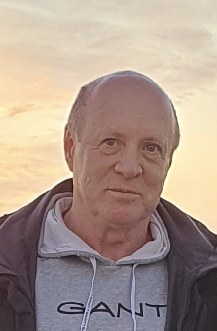
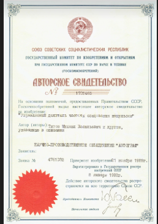
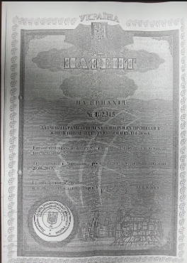

# Mykhailo Titov

**Engineer | Embedded Systems | Electronics | AI-assisted Development**  
**CTO & CEO – Embedded & AI Systems** | Более 30 лет опыта

<a href="https://htmlpreview.github.io/?https://github.com/Michael-VT/qr_link_repositories/main/repos_gallery.html">
    My Repositories Gallery
</a>

📍 **Lisbon, Portugal** (EU Temporary Protection)  
Open to **US Remote / Relocation** (H1B / TN / O1)

---

### 🔗 Быстрые ссылки
- **[LinkedIn](https://www.linkedin.com/in/michael-vt/)**
- **[Full summary (PDF)](https://michael-vt.github.io/cv/20260507-CTO&CEO–Embedded.pdf)**
- **[Gallery of all projects with QR codes](https://michael-vt.github.io/cv/repos_gallery.html)**

---

## 🚀 Featured Public Projects

**[Open project gallery →](https://michael-vt.github.io/cv/repos_gallery.html)**

**Interactive gallery** with QR codes, screenshots, and descriptions—easy to access from your smartphone.

---

## 💼 Key competencies

- **Embedded Systems** — STM32, MSP430, FPGA, FreeRTOS, Bare Metal
- **Low-level & Optimization** — Working with limited resources (64 KB Flash and below)
- **AI & Modern Development** — Daily use of LLM (Grok, Claude, etc.) for code generation and optimization
- **Protocols** — HART, ZigBee, Modbus, CAN, USB, Ethernet
- **Full cycle** – from idea and prototype to serial production

**Languages and tools**: C/C++, Python, Pascal, Assembler, VHDL, KiCad, STM32CubeIDE, IAR, etc.
---

## 🧭 Key stages of career

- **CTO / CEO** — Embedded & AI Systems (2020 - present)
- **Lead Embedded Engineer** — Oil & Gas Instrumentation (2014 — 2020)
- **Senior Embedded Software Engineer** — Various international projects (2008 — 2014)
- **Embedded Systems Engineer** — Industrial Electronics (1990 — 2008)
- **Beginning of a career** — Radio Electronics (1986 — 1990)

**Full detailed work experience** (more than 15 positions, projects, patents, achievements) - see below.
---

## 📜 Full work experience


Mykhailo Titov


 
 

Engineer (Electronics engineer, circuit designer, technologist, and programmer from Ukraine.)

 

CTO & CEO – Embedded & AI Systems

 

| 30+ Yrs Embedded R&D

 

📍 Lisbon, Portugal (EU Temporary Protection for Ukraine, Kharkiv)

 

[LinkedIn](https://www.linkedin.com/in/michael-vt/)
 : michael-vt
 

📧 m.v.titov@gmail.com

 

🔗 github.com/Michael-VT

 

Ready for US Remote / Relocation (H1B/TN/O1)


Profile:

Availability:
Ready to start work within a week (secure development environment within 48 hours), either 100% remote work, or full relocation. I really like Portugal, and if you could help me with the opportunity to earn money remotely with an official contract, I would be interested in continuing my residency in Portugal rather than terminating my residency in March 2027 due to the end of the Temporary Protection Program for Ukrainians.

Ready for 100% remote work or relocation to the US (possibility of obtaining an H1B/TN/O1 visa).

I am easy-going, adaptable, and adaptable, and I am always willing to consider alternative options. I really enjoy engaging in interesting creative work.

Languages:
Russian (native)
Ukrainian (native)
English (B1-B2 not officially certified, daily self-improvement and communication with friends in Portugal from Canada, England, and Portugal; previously worked extensively with technical documentation)
Portuguese (certified B1-B2, but not as fluent as English)

### Core Technical Skills:

#### Programming Languages:

PLM, Pascal, C/C++ (debugging, MISRA, proficiency in C++20), Python/MicroPython (scripting and prototyping, test scripts, data and coefficient analysis/preparation), assembler (multiple instruction sets).
Performance and Numerical Computing: Fixed- and floating-point math, mixed-precision kernels, quantization-aware training aids using LLM, manual SIMD-like vectorization on non-SIMD cores.

#### Low-Level Optimization:

Code size reduction/optimization, instruction scheduling, cacheless memory layout, real-time cycles < 5 µs, memory model tuning.

#### AI Development:

Daily use (Grok, Claude, DeepSeek, ChatGPT, Mistral, GitHub-Copilot, Perplexity, and MCP for Blender, KiCAD, and FreeCAD) to create finished and currently volunteer projects.

#### Embedded System Limitations:

On target devices, I significantly reduced power consumption by optimizing performance, computational efficiency, RAM/64 KB Flash usage, and even command usage. When the environment allowed and development time was limited, I used FreeRTOS and MISRA-C.

#### Hardware Launch:

Emulation of Intel 8080 processors along with the hardware it worked with. Emulation of the ZigBee protocol using an Ember modem on MSP430 microcontrollers. Emulation of real-time protocols and systems on FPGAs (Xilinx Spartan-6/Artix-7). Everything was simulated down to the command cycle. This allowed projects to be completed within a reasonable timeframe and deliver workable results.

### Key technical skills:

#### Testing and quality control:

Test planning, modeling and simulation of faults, code interaction analysis, parallel development of validation and verification methods for specific products.

#### Protocols:

HART, ZigBee, OneWire, CAN, HART, Modbus, TCP/IP, Ethernet, USB, RS485, RS232.

#### Embedded systems:
FreeRTOS real-time systems, integration of multiple microcontrollers to achieve an effective solution to the target problem using a comprehensive project approach focusing on "price" - "energy efficiency" - "product performance and product lifecycle" - "maximum manufacturability in production" - "maximum user comfort with simultaneous simplicity and ease of maintenance."

#### Tools:

Wireshark, STM32CubeIDE, STM32CubeMX, IAR MSP430, MPLAB with JTAG/SWD debuggers, environmental chambers, testing in production and at power plants under real-world operating conditions. And many other useful tasks for completing projects to assess the quality and reliability of devices.

### Safety and Standards:

Processes similar to ISO 26262, HART certification, product certification according to relevant standards and requirements, patent verification
Collaboration: Cross-functional teams (testing, production, documentation development, hardware development and installation, mechanical/enclosure engineering, basic and periodic testing, trial operation; working with teams of 5 to 27 people). In almost all projects, I served as the lead project developer, circuit designer, programmer, and quality controller. In some situations, I trained people who later worked on projects with me.

### Professional experience:

Self-employed engineer specializing in the integrated development of electronic products with accompanying software (from discussion to turnkey production), maximizing optimization from the ground up.

Currently working on a seismic activity detection project: for now, I'm primarily doing a lot of preparatory and research work, testing sensor integration, power consumption distribution, and detecting the position and parameters of anomalies in simulated environments.

2023–2026 | Experimenting with the use of deep learning and AI systems (Grok/Claude/DeepSeek, etc.).

Self-employed electronics support and development engineer with software for high-precision measurement systems, pressure, and level sensors.
September 2007–2026 | Kharkiv, Ukraine until 2022 | Lisbon, Portugal - 2022–present
Since 2025, I've been using LLM daily for my personal educational projects. Some of my projects have been published on GitHub.
Developed Python/MicroPython test scripts and Arduino programs to test the functionality of concepts on ATMega/MSP430Fxxx/STM32/ESP6288/ESP32/RP2040 microcontrollers, including error injection testing and code coverage.

Independent researcher and developer, May 2013 – October 2016
• Worked in the field of home automation, participated in the [eCozy](https://ecozy.de/) project:
◦ Created a prototype operating in the sub-GHz frequency range;
◦ Participated in the development of a device simulator operating with a prototype device via the ZigBee HA 2.4 GHz protocol (using a CC430F137 microcontroller with the IAR development environment and a graphical user interface for Windows using QT Creator);
◦ Developed a system for automated protocol testing with and without a device (using the ZigBee HA protocol).
Manual optimization of fixed/floating-point and mixed-precision arithmetic for real-time signal processing on microcontrollers up to 64 KB.

2002-2007 – 2013 | Ukraine
Lead engineer developing the structure, circuit, and concept of the Safir-M digital pressure sensor. This was only possible by implementing an architecture based on four microcontrollers operating in parallel. Developed test plans and performed validation for a system of four microcontrollers (work began with prototypes of TI XSP430 microcontrollers, and by the end of the project, serial TI MSP430 microcontrollers, which had just entered production). Our team performed complex tasks, including multi-purpose debugging, development, prototype and final product manufacturing, programming and configuration of sensors in batches of 16 using our own technological hardware and software. Development of a hardware and software system for the full cycle of sensor configuration and training in temperature conditions, similar to HIL.
Investigated problems in the field through data analysis, reproducing failures in climate chambers, vehicles, and in production environments. He was in constant contact with bedside users.
He also served as the lead engineer for product quality control and development quality – the Safir-M pressure sensor with 0.1% accuracy, 4-20 mA and 0-5 mA output signals, and a HART protocol over them, along with a color graphic OLED display. He manually rewrote all mathematical calculations in a mixed format with fixed and floating point, significantly reducing the code size and reducing the power consumption for the graphic OLED display. He also simplified the product setup process, while maintaining a response time of <0.1 s, and maintaining all key parameters within this class even when adjusting the measurement range by 1/10. The product has passed HART certification and received patent UA 102315. As a result, the Safir-M sensor was launched into production and has been in serial production since 2013 at Manometer-Kharkiv CJSC in Kharkiv, at its plant in Merefa. Incidentally, I developed the electronics and software for all previous digital pressure sensors for this company (the circuit diagram, circuit boards, sensor software, and sensor configuration software). As far as I know, they were still producing these sensors two years ago.

Participated as a lead developer (design, software, design, and user interface) in the development of various products (home security, monitoring and geolocation, tire pressure monitoring, and industrial pressure sensors). Many products have entered serial production. 1998–2007 | Ukraine

The engineer worked in various commercial entities involved in the production and sale of cables, wires, and chemical products. August 1995 – 2002

Previous experience as a lead developer.

JSC "SVM" Technical Director and Co-Founder. August 1993 – August 1995
Development of corporate security systems and comprehensive provision of computer and network equipment for accounting and design work, as well as turnkey projects including network installation and computer integration.

JSC "Pioneer" Founder, Technical Director. | April 1991 – August 1993
• "Radio Telemetry System for the Orel Water Utility with 12 Artesian Wells"
A radio monitoring and control system was developed for the distributed water supply system in Orel, consisting of 12 artesian wells around the city, which required constant monitoring of the equipment's parameters and performance. The project is interesting because before the system's development began, work had already been underway for over two years, but there was essentially nothing working, even though they were in constant contact with me, and there was hope that something had already been created. As a result, to speed up the prototype and development process, the system was prototyped using only a modem, and the plotter's main board was used as the microcontroller. Three months later, the system was operational, and six months later, intelligent modems were installed in all the wells, and monitoring began.
• The finished product operated for over 10 years, and negotiations for its improvement were underway (but these were already in different countries).

Private Company "AIT" Chief Project Designer May 1991 – February 1993 continued to develop and developed the next version of the A3 roll plotter. The next generation doubled the drawing speed, tripled the accuracy, quadrupled the energy consumption, and was superior to the mass-produced product in all respects. However, at this time, the country collapsed.

Scientific Production Association "Autograph" Chief Project Designer from June 1987 to April 1991, 1993
• Developed the A3 "Autograph-8452" roll plotter with 3rd acceptance certification (suitable for civilian use).
• The project won a tender among numerous similar projects. After its initiation, assisted with the launch of the "Autograph-8452" plotter at the Lviv Machine-Building Plant, where the product remained in production for several years.
The development of the plotter circuit and software was carried out in a comprehensive manner (product, tooling, and development of a plotter simulator with two modes: operation in the test simulator's graphic window and operation as a debugger directly on the working hardware). This contributed to winning a national tender and launching serial production in three cities, but only Lviv was able to quickly master the product's production and produce over 3,000 units.

Research Intern. Kharkiv National University of Radio Electronics | - November 1986 – June 1987
Laboratory of Non-Destructive Testing of Composite Materials. Computer Department.
• Developed a multifunctional generator of ultrasonic multi-structure signals.
• Created specialized research equipment for a test bench and emitting equipment for non-destructive testing of composite materials for structural quality.

Worked in a student research team in the final year as a team leader. 1982-1986 in parallel with studies.

Education

Kharkiv National University of Radio Electronics | 2004–2005
SolidWorks Designer Specialist

Kharkiv National University of Radio Electronics | 1981–1986
Major: Electronic Device Engineer (0611)
Master of Engineering Sciences in Electronic Devices and Instruments, Microcircuit Manufacturing Technologies, and Microarchitecture and Real-Time Systems.
• Actively participated in a student research group from his second year.
• In my second year of study, I began working on my final thesis, developing an onboard computer for a vehicle (motorcycle, car) with a parameter management system (fuel level, outside temperature) and engine operation control (ignition control with triple backup to purely mechanical in case of electronic failure). In our case, we planned to install it as a radio receiver with a digital display to allow for easy installation in cars produced by the Soviet automobile industry. I defended my thesis on this topic with distinction. Over the next several years, students defended their thesis projects on this project. An additional fuel level sensor was developed for it: a level-frequency plus pulse-portion sensor, similar to those in sports aircraft, with dual redundancy and instantaneous fuel consumption readings.

Immediately after school, I worked at the Donetsk Metallurgical Plant as a driller on a radial drilling machine | 1980–1981

[Featured Public Projects](github.com/Michael-VT):

[STM32F769I-Disco](https://github.com/Michael-VT/STM32F769I-Disco): Prototyping a sensor communication system using the STM32F769I-Disco kit, arm-none-eabi, and the [oh-my-PI](https://github.com/can1357/oh-my-pi/tree/main) AI for programming.

[spectrum_analyzer](https://github.com/Michael-VT?tab=repositories): An example of how to analyze an audio file signal in Python and present the results graphically.

[USBs](https://github.com/Michael-VT/USBs): A terminal program written in Python for working with serial communication with devices.

[2xEncoder](https://github.com/Michael-VT/2xEncoder): FPGA device for monitoring and displaying the number of pulses from an encoder, taking into account the direction of rotation.

[gps-tracker-atgm336h](https://github.com/Michael-VT/gps-tracker-atgm336h): Testing GPS tracking and navigation options

[thisis-11ty](https://github.com/Michael-VT/thisis-11ty): This is Blog SEO 11ty About home automation with IoT and AI, a collection of articles analyzing the future.

[Tetris-with-AI](https://github.com/Michael-VT/Tetris-with-AI): Testing different AI systems for generating a Tetris game in JavaScript as a web app.

[CNC-Tools](https://github.com/Michael-VT/CNC-Tools): Source code for optimizing the PCB drilling process using a Gerber file.

[CUDA examples with batch file to run](https://github.com/Michael-VT/CUDA): Program verification and early experiments with fixed and Floating-point memory on a CUDA core

[CNCDril](https://github.com/Michael-VT/CNCDril): Converter of DRL (P-CAD, Altium) drill files to G-Code (CNC) with various optimization methods.

[PICLab debugger for PIC16F876 (Microchip)](https://github.com/Michael-VT/PICLab): Debugger and simulator for PIC16 microcontrollers and for debugging directly in the product.

[SimpleCalc](https://github.com/Michael-VT/SimpleCalc): The calculator project, written in Qt, demonstrates that the project is very fast to write and runs.

Confirmation of a high level of professionalism:

After joining JSC Manometer-Kharkov and receiving the task of developing the Safir-M sensors (a sensor with digital signal conversion and a control panel with an LCD screen, compared to the old Safir version with analog signal conversion), I was able to participate in an exhibition within three months and deliver samples to customer factories for testing. Three months later, I began serial production of the newly created products. Six months after I left the company, management asked me to develop a more promising version of the Safir-M sensor with a HART protocol for them. It is available on their website [CJSC "Manometer-Kharkov"](https://manometr-kharkiv.com/product-category/vymiriuvannia-tysku/) as the "Safir 2xxx K" and "Safir-M 5xxx series." I acted as a third-party organization responsible for a comprehensive set of tasks, including quality control, testing, and certification of the product for compliance with all industrial standards. I also served as the project manager, programmer, circuit designer, and mentor (I also trained the people who assisted me in the methods and tools for working on the project: Altium, IAR MSP430, Git, Doxygen, and Borland Delphy—all of which were used by our team during the project). I managed the project, which, after two years, resulted in certification and subsequent launch of the product into production, along with the necessary technological equipment. All work was completed by a team of four people. The result of the work: a sensor powered by a 4-20 mA current loop, on four microcontrollers, with an accuracy of 0.1%, HART communication and an OLED interface, operating within the budget of a 4 mA current loop (as a result, an option was chosen with 4 microcontrollers communicating with each other via the SPI protocol and special optimization of the circuitry with a multi-level power supply (such as according to the scheme (3V x 3mA) + (3V x 3mA) + (3V x 3mA) = (3V x 9mA)), software - with a HART protocol and a HART modem) Safir-M (you will be surprised to see where Safir sensors manufactured by JSC "Manometer-Kharkov" until 2006 and since June 2006 CJSC "Manometer-Kharkov" are used).
Having previously developed a plotter, I managed to create the product from scratch to mass production in just four years, win a competition, and launch production, bringing two other developers I knew from my institute, who graduated a year after me, into the company. I consider this an achievement for that time and in that country.

Over 30 years of experience developing low-level, embedded applications and electronic products with real-time systems, focusing on core, unbreakable functionality while simultaneously integrating debugging and logging systems in assembler, C/C++, and Python. Performance optimization is also key, all on platforms with strict resource constraints (8-32-bit microcontrollers, 2-128 KB of RAM/flash memory). Extensive experience developing specific fixed- and mixed-precision arithmetic, instruction scheduling, memory allocation, and code size reduction for embedded real-time systems with maximum efficiency. Performed testing, debugging, and certification of low-power hardware. Recently, I have regularly used LLM programs (Grok, Claude (chat and MCP), DeepSeek, Mistral, GitHub-Copilot, Perplexity, etc.) to assist (programmers, artists, and designers) in implementing my pilot projects. I wrote code for RISC-V and ARM Cortex-M, and also developed my own DSP extensions for normalizing pressure sensor signals and interpolating optimal plotter pen movement in real time using the microprocessor. I have experience verifying assembly/C/C++ code (Intel 8048, 8080, Microchip PIC14, PIC16, MSP430, which I used in production products), and developing test frameworks/simulators/simulators (Borland C++ 4.0-6.0/Borland Delphi 5.0-7.0/Qt Creator)/Python/MicroPython - Thony). I tested and validated virtually all manufactured products under harsh conditions (shocks and temperatures from -40°C to +85°C). I'm currently developing a seismic warning system, which involves developing a system for integrating a sensor suite and collecting, storing, and processing the resulting data, as well as managing its own autonomous power supply. Currently, I'm using STM32 and ESP32-based modules. (It would be great if you could sponsor or partner with me on this project, although I'd be very surprised, as it's usually dismissed outright or never read this far.)

I really enjoy being on the cutting edge of modern technology, and even better, being directly involved in it. It's very difficult for someone like me to find work these days where I can fully utilize my skills, but I'd really like to. I've even considered finding a patron or sponsor who would help officially conduct such work in Portugal, and creating something akin to a department here to develop and test various ideas, perhaps even mine, such as "multifactor seismic sensors for early warning of local seismic activity for the population." I think I could last another 10 years, which would certainly be enough to develop the idea into a truly useful product. And perhaps we could even build a modern development team.

I hope I get at least some kind of adequate response from a human, not an AI.

Few people read my resumes, and those like this never read to the end. Even those that I optimized with the help of various AIs, so that they would still be read to this point.

 "Certificate of authorship"

 "Patent"

(Michael V Titov. MYKHAILO TITOV)

---

## 🚀 Featured Public Projects & Experiments

**[Open the gallery of all projects with QR codes](https://michael-vt.github.io/cv/repos_gallery.html)**

**Interactive gallery** with screenshots, short descriptions, and QR codes for quick access to repositories directly from your smartphone.

---

## 🎓 Education

- Kharkiv National University of Radio Electronics — Engineer in Electronic Devices (1981–1986)
- SolidWorks Designer Specialist (2004–2005)

---

**Ready to start work as soon as possible.**  
Open to discussing interesting challenges in Embedded Systems, IoT, and AI-driven development.
---

